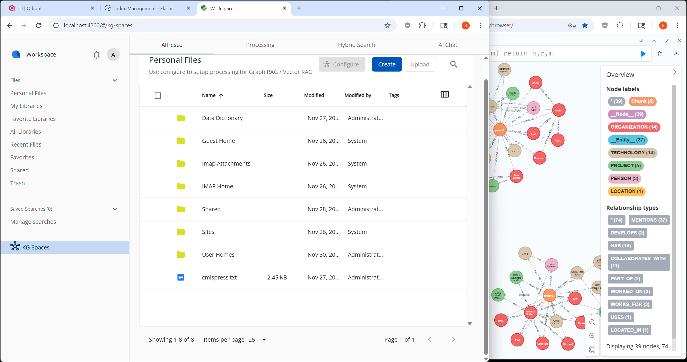

# KG Spaces Integration of Flexible GraphRAG with Alfresco Content Application (ACA)



This integration combines [Flexible GraphRAG](https://github.com/stevereiner/flexible-graphrag) with the Alfresco Content Application to provide AI-powered document search, knowledge graph capabilities, and intelligent chat within Alfresco.

**Note:** This initial integration is based on the ACA 7.2.0 release tag.

## Quick Start

### Prerequisites

1. **Have Alfresco running and configured with Flexible GraphRAG and KG Spaces**
   - Flexible GraphRAG docker compose includes Alfresco Community 25.2 (uncomment to use)

2. **Run the latest Flexible GraphRAG backend** (updated with changes to enable KG Spaces)
   ```bash
   uv run start.py
   ```

3. **Clone this repository**
   ```bash
   git clone https://github.com/stevereiner/kg-spaces-aca.git
   cd kg-spaces-aca
   ```

4. **Install dependencies and start the application**
   ```bash
   npm install
   npm start
   ```

5. **Open in your browser**
   - Navigate to `http://localhost:4200/`

## Using KG Spaces

### Login
- If you don't see the login dialog, log out of any other Alfresco clients first
- Use your Alfresco credentials to log in

### Navigation Options

**Option 1: KG Spaces Sidebar Navigation**
- Look for **"KG Spaces"** at the bottom of the sidebar
- Click to access the 4-tab interface:
  - **Configuration Tab**: Select data sources and configure settings
  - **Processing Tab**: Process documents and build knowledge graphs
  - **Search Tab**: Perform hybrid search and Q&A queries
  - **Chat Tab**: Interactive AI chat with your documents
- Use the **CONFIGURE toolbar button** to select and process content

**Option 2: Regular ACA UI with Graph Hub**
- Use the standard Alfresco Content Application interface
- Multi-select files/folders in the file browser
- Click the **Graph Hub icon** in the toolbar (or use context menu **Graph Hub icon + Configure**)
- This launches the same KG Spaces functionality for the selected content

### Workflow

#### 1. Select Content (Alfresco Tab)
- Navigate to **Personal Files** (or **Company Home** repository if admin)
- Multi-select files and/or folders you want to process
- Click the larger **CONFIGURE button with Graph Hub icon**
- You'll be automatically navigated to the **Processing Tab**

#### 2. Configure Processing Options
- Review or change your selection
- **Optional**: Check **"Skip graph + vector auto-building"** to:
  - Only perform vector and full-text indexing (faster)
  - Skip knowledge graph creation (which takes much longer)
- **Note**: For folders, only the first level is processed (non-recursive)

#### 3. Start Processing
- Click **START PROCESSING** to begin
- Monitor progress as documents are indexed

#### 4. Query Your Documents

Once documents are processed, you can:

**From the Hybrid Search Tab:**
- Perform **hybrid search** queries (combines vector, full-text, and graph search)
- Ask **AI questions** for natural language answers

**From the AI Chat Tab:**
- Engage in **conversational AI** queries
- View **chat history** of all your questions and answers
- Get context-aware responses based on your document collection

### Features

#### User Interface Flexibility
- **Alfresco Tab View**: Dedicated KG Spaces interface with integrated Alfresco repository browser
- **Regular ACA UI**: Use standard Alfresco interface with toolbar button and context menu for Graph Hub access
- **Multi-select**: Works seamlessly in both UI modes

#### AI-Powered Hybrid Search
- **Full-Text Search**: Traditional keyword-based search using Elasticsearch or OpenSearch
- **Vector Search**: Semantic similarity search using embeddings
- **GraphRAG**: Knowledge graph traversal for contextual, relationship-aware retrieval
- **Combined Power**: All three methods work together for comprehensive results

#### Performance Control
- **Selective Processing**: Choose which documents get full graph + vector indexing
- **Fast Mode**: Vector-only indexing for quick processing when graphs aren't needed
- **Granular Control**: Process only what you need, when you need it

#### Database Flexibility
**[Flexible GraphRAG](https://github.com/stevereiner/flexible-graphrag)** provides extensive database support:
- **10 Vector Databases**: Choose your preferred vector storage backend
- **8 Graph Databases**: Select from multiple graph database options
- **Search Engines**: OpenSearch or Elasticsearch support for full-text search

---

# Alfresco Content Application

Please refer to the public [documentation](https://alfresco-content-app.netlify.app/) for more details

## Requirements

| Name    | Version |
|---------|---------|
| Node.js | 18.x    |
| Npm     | 9.x     |

## Compatibility

| ACA   | ADF           | ACS        | Node | Angular |
|-------|---------------|------------|------|---------|
| 7.2.x | 8.2.1         | 23.x, 25.x | 22.x | 19.x    |
| 7.1.x | 8.1.1         | 25.2       | 22.x | 19.x    |
| 7.0.x | 8.0.0         | 25.2       | 22.x | 19.x    |
| 6.0.x | 7.0.0         | 25.1       | 20.x | 17.x    |
| 5.3.x | 7.0.0-alpha.7 | 23.4       | 18.x | 16.x    |
| 5.2.x | 7.0.0-alpha.6 | 23.4       | 18.x | 16.x    |
| 5.1.x | 7.0.0-alpha.3 | 23.3       | 18.x | 15.x    |
| 5.0.x | 7.0.0-alpha.2 | 23.3       | 18.x | 15.x    |
| 4.4.x | 6.7           | 23.2       | 18.x | 14.x    |
| 4.3.x | 6.4           | 23.1       | 18.x | 14.x    |
| 4.2.x | 6.3           | 23.1.0-M4  | 18.x | 14.x    |
| 4.1.x | 6.2           | 7.4        | 18.x | 14.x    |
| 4.0.x | 6.1           | 7.4        | 14.x | 14.x    |
| 3.1.x | 5.1           | 7.3        |      |         |
| 3.0.x | 5.0           | 7.3        |      |         |

> See <https://angular.io/guide/versions> for more details on Angular and Node.js compatibility

## Running

Create an `.env` file in the project root folder with the following content

```yml
BASE_URL="<URL>"
```

Where `<URL>` is the address of the ACS.

Run the following commands:

```sh
npm install
npm start
```

## Unit Tests

Use following command to test the projects:

```sh
nx test <project>
```

### Code Coverage

The projects are already configured to produce code coverage reports in console and HTML output.

You can view HTML reports in the `./coverage/<project>` folder.

When working with unit testing and code coverage improvement, you can run unit tests in the "live reload" mode:

```sh
nx test <project> -- --watch
```

Upon changing unit tests code, you can track the coverage results either in the console output, or by reloading the HTML report in the browser.

