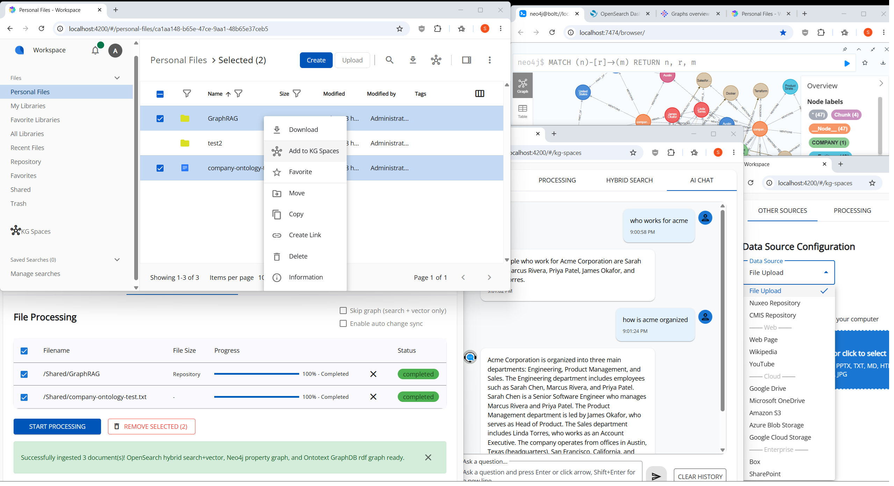

# KG Spaces for Alfresco Content App (ACA)

[](LICENSE)
[](https://github.com/Alfresco/alfresco-content-app)
[](https://github.com/Alfresco/alfresco-ng2-components)
[](https://angular.dev/)

Knowledge graphs generated from your documents, alongside vector and fulltext indexes, provide
the context for hybrid search, AI query and AI chat — over Alfresco content and other data
sources, as an extension to the **Alfresco Content App (ACA)**.

It is powered by [Flexible GraphRAG](https://github.com/stevereiner/flexible-graphrag), an open
source AI context platform supporting a document processing pipeline (Docling, LlamaParse, or
LiteParse), knowledge graph auto-building, ontologies, schemas, many LLM providers, GraphRAG and
RAG, hybrid semantic search (fulltext, vector, property graph, RDF/SPARQL), AI query, and AI chat.
See its [documentation](https://stevereiner.github.io/flexible-graphrag/) and
[UI guide](https://stevereiner.github.io/flexible-graphrag/HOME/HOME-UI-GUIDE/).

AI context can be kept up to date with **auto change sync** from Alfresco, Nuxeo, SharePoint,
Box, Amazon S3, Azure Blob Storage, Google Cloud Storage, Google Drive and OneDrive, and ingested
without auto sync from File Upload, CMIS, Web Pages, Wikipedia and YouTube.



Select content in ACA's own document list and send it to KG Spaces with **Add to KG Spaces**,
from the right-click menu or the toolbar. Here a folder and a document are selected together:
each becomes its own row on the PROCESSING tab, and the folder expands to its contents, so two
rows ingest three documents into OpenSearch (hybrid search + vector), a Neo4j property graph
and an Ontotext GraphDB RDF graph. The AI CHAT tab then answers from the extracted graph, and
OTHER SOURCES offers the non-Alfresco sources Flexible GraphRAG supports.

## What this repo is, and is not

It contains **only the extension**. No ACA source is copied here and no ACA file is patched,
which is what lets this repo be Apache-2.0 while ACA itself is LGPL-3.0. You install it into
your own ACA (or ADW).

| Path | Role |
| --- | --- |
| `kg-spaces-aca-ext/` | the ACA extension (Angular source, compiled by the host app) |
| `config/` | snippets for the host's `app.config.json`, dev-server proxy, and production nginx |
| `scripts/` | `patch-aca.mjs` (install steps 3–5 in one go) and `install-lib-into-aca.sh` |
| `docker/` | an image that builds ACA with the extension and serves it with nginx |
| `screen-shots/` | images used in this README |

The four tabs — Sources, Processing, Hybrid Search, AI Chat — are **not** duplicated here.
They come from [`@flexible-graphrag/angular-ui`](https://www.npmjs.com/package/@flexible-graphrag/angular-ui),
the shared library built out of the Flexible GraphRAG repo and published to npm, so the
standalone app and this extension cannot drift apart.

## Authentication: no password, no custom login

The extension reads the Alfresco ticket ADF already stored at sign-in (`ticket-ECM` in
localStorage) and passes it to the backend as a pass-through credential in the ingest payload.

Nothing captures a password, no ACA login component is replaced, and the backend never stores
the ticket — for auto-sync it substitutes a configured service account instead, because a
ticket expires and cannot renew itself.

## Prerequisites

* **Alfresco Community 26.2+**, running. Flexible GraphRAG's
  [Docker Compose setup](https://stevereiner.github.io/flexible-graphrag/HOME/HOME-DOCKER/) can
  include Alfresco Community together with OpenSearch or Elasticsearch, either dedicated to
  Alfresco or shared with Flexible GraphRAG. Not tested with Alfresco Enterprise.
* A running Flexible GraphRAG 0.8.2+ backend (default `http://localhost:8000`).
* Flexible GraphRAG and ACA both configured for your Alfresco.
* An [ACA 8.0.0](https://github.com/Alfresco/alfresco-content-app) checkout (Angular 20.3, ADF 9.0).
* Node.js 24 — ACA 8.0.0 pins 24.13.1 in its `.nvmrc`. (Not needed for the
  [Docker build](#docker), which brings its own.)

## Install into ACA

### 1. Copy the extension

```bash
# from the root of your alfresco-content-app checkout
cp -r /path/to/kg-spaces-aca/kg-spaces-aca-ext projects/kg-spaces-aca-ext
```

### 2. Install the shared UI library

```bash
# also from the root of your alfresco-content-app checkout -- not in this repo
npm install @flexible-graphrag/angular-ui --legacy-peer-deps
```

[`@flexible-graphrag/angular-ui`](https://www.npmjs.com/package/@flexible-graphrag/angular-ui)
is published to npm. `--legacy-peer-deps` is the flag ACA's own install already needs.

> **Working on the library itself:** to try unreleased library changes, install a tarball
> packed from a local [Flexible GraphRAG](https://github.com/stevereiner/flexible-graphrag)
> checkout instead (`npm run pack:lib` in `flexible-graphrag-ui/frontend-angular`). Then also
> clear `.angular/cache`: the version does not change between dev packs, so the Angular CLI
> keeps serving the previously compiled copy and your changes silently do not appear.
> [`scripts/install-lib-into-aca.sh`](scripts/install-lib-into-aca.sh) packs, installs and
> clears in one step. To go back to the published package, name a version —
> `npm install @flexible-graphrag/angular-ui@latest --legacy-peer-deps` — since a bare
> package name keeps the `file:` tarball reference in `package.json`.

> **Shortcut for steps 3–5:** `node scripts/patch-aca.mjs /path/to/alfresco-content-app` makes
> all three changes below for you, and is safe to run again — after an upgrade it adds any new
> `plugins.kgSpaces` settings without touching the values you already set. The steps are
> spelled out so you can see exactly what it touches.

### 3. Register the extension

In `app/src/app/extensions.module.ts`:

```typescript
import { provideKgSpacesExtension } from '../../../projects/kg-spaces-aca-ext/src/public-api';

export function provideApplicationExtensions(): (Provider | EnvironmentProviders)[] {
  return [
    ...provideKgSpacesExtension(),
    // keep the existing ACA extensions here
  ];
}
```

### 4. Ship the plugin JSON as an asset

In `app/project.json`, add to `build.options.assets`:

```json
{
  "glob": "kg-spaces.plugin.json",
  "input": "projects/kg-spaces-aca-ext/src/assets",
  "output": "./assets/plugins"
},
{
  "glob": "agent.png",
  "input": "projects/kg-spaces-aca-ext/src/assets",
  "output": "./assets/plugins"
}
```

Both entries are needed: the second is the AI-chat avatar. The shared library defaults it to
`assets/agent.png`, which exists in the standalone app but not in an ACA host, so the extension
ships its own copy and points `agentIconUrl` at it.

### 5. Configure the backend URL

Merge [`config/app.config.snippet.json`](config/app.config.snippet.json) into
`app/src/app.config.json`. Every key has a default, so a partial block works.

| Key | Purpose |
| --- | --- |
| `apiUrl` | Flexible GraphRAG backend, same-origin via the proxy |
| `alfrescoBaseUrl` | where the **backend** reaches Alfresco, server to server. Not `ecmHost`, which is where the browser reaches it |
| `agentIconUrl` | AI-chat avatar; the extension ships its own copy |
| `enabledSources` | which sources the **OTHER SOURCES** tab offers, in picker order |
| `recursive` | whether a selected **folder** brings its subfolders along (default `false`) |

**Folders and subfolders.** With `recursive: false` (the default), a folder selected in ACA
ingests only the documents directly in it; set `"recursive": true` to include every subfolder
at any depth. Auto change sync then covers the same scope. Like the other keys, it is read from
`app.config.json` at startup — in the Docker image, edit `/usr/share/nginx/html/app.config.json`
or rebuild with the value changed in `config/app.config.snippet.json`.

**Customising the source list.** Trim `enabledSources` to offer fewer sources. `alfresco` is
deliberately absent: ACA's own document list is the Alfresco picker here. Adding `"alfresco"`
back is supported and needs no rebuild — the source form could be useful for a *different*
Alfresco server than the one you signed in to, with its own basic / ticket / OAuth2 credentials.
The snippet carries the full list as `_sample_enabledSources_FullList` to copy from.

### 6. Proxy the backend in dev

Add the `/api` entry from [`config/proxy.conf.snippet.js`](config/proxy.conf.snippet.js) to the
object `app/proxy.conf.js` already exports, next to ACA's own `/alfresco` entry, then
`npm start`. *KG Spaces* appears in the left navigation. The backend defaults to
`http://localhost:8000`; set `FG_BASE_URL` (in the environment or ACA's `.env`, alongside its
`BASE_URL`) to use another.

### 7. Serving a production build

`proxy.conf.js` only exists under the dev server. When you build ACA (`npx nx build content-ce
--configuration=production`) and serve it from your own nginx, add
[`config/nginx.snippet.conf`](config/nginx.snippet.conf) inside the `server { }` block that
serves ACA, with `proxy_pass` pointed at your backend. Besides the `/api` route it raises the
upload limit — nginx's 1 MB default rejects most documents on the OTHER SOURCES tab — and allows
for slow LLM calls. The [Docker image](#docker) already includes all of this.

## Docker

As an alternative to installing into your own ACA checkout, [`docker/Dockerfile`](docker/Dockerfile)
builds an image containing ACA 8.0.0 with the extension already wired in, served by nginx. It
clones ACA, copies the extension into `projects/`, runs `scripts/patch-aca.mjs`, and builds — so
no ACA source ever lives in this repository.

### Build

```bash
docker build -t kg-spaces-aca -f docker/Dockerfile .
```

The shared UI library comes from npm by default (`LIB_SOURCE=npm`, latest version; pin one with
`--build-arg LIB_VERSION=0.8.2`). Two other sources are there for unreleased library changes:

**From a Flexible GraphRAG clone.** The build clones `FG_REPO` at `FG_REF` and packs the
library inside the image:

```bash
docker build --build-arg LIB_SOURCE=git -t kg-spaces-aca -f docker/Dockerfile .
```

This needs a Flexible GraphRAG version that includes the library (0.8.2+); an older `FG_REF`
stops early with a message saying so.

**From a tarball you built.** Pack the library from your own clone, copy it into `docker/lib/`,
and point the build at it:

```bash
cd flexible-graphrag/flexible-graphrag-ui/frontend-angular
npm install && npm run pack:lib
cp dist/flexible-graphrag-angular-ui-*.tgz /path/to/kg-spaces-aca/docker/lib/

cd /path/to/kg-spaces-aca
docker build --build-arg LIB_SOURCE=local -t kg-spaces-aca -f docker/Dockerfile .
```

### Run

```bash
docker run -d --name kg-spaces-aca -p 4280:8080 kg-spaces-aca
```

`-d` runs it in the background, `--name` lets you refer to it later, and `-p 4280:8080` publishes
the container's port 8080 on host port 4280 — without `-p` the container runs but has no URL.
4280 rather than 4200 keeps it clear of an ACA dev server.

Open **`http://127.0.0.1:4280`**. Browsers share `localhost` cookies across ports, so if you also
run another ACA or Alfresco UI on `localhost`, its session cookie can make this login fail with
"unknown username or password"; `127.0.0.1` gets a separate cookie jar.

```bash
docker logs kg-spaces-aca          # startup output, including the runtime config it applied
docker stop kg-spaces-aca          # stop; `docker start kg-spaces-aca` resumes it
docker rm -f kg-spaces-aca         # remove, e.g. before running a rebuilt image
```

Override any runtime variable below with `-e`, for example
`-e FLEXIBLE_GRAPHRAG_URL=http://my-backend:8000`.

| Build argument | Default | |
| --- | --- | --- |
| `ACA_TAG` | `8.0.0` | Alfresco Content App tag to build |
| `LIB_SOURCE` | `npm` | `npm` to install the published library, `git` to build it from `FG_REPO`, `local` to use `docker/lib/*.tgz` |
| `LIB_VERSION` | `latest` | library version or tag, for `LIB_SOURCE=npm` |
| `FG_REPO` / `FG_REF` | `github.com/stevereiner/flexible-graphrag` / `main` | where the library is built from, for `LIB_SOURCE=git` |

| Runtime variable | Default | |
| --- | --- | --- |
| `ALFRESCO_URL` | `http://host.docker.internal:8080` | where nginx reaches Alfresco |
| `FLEXIBLE_GRAPHRAG_URL` | `http://host.docker.internal:8000` | where nginx reaches the backend |
| `KG_SPACES_ALFRESCO_BASE_URL` | as built (`http://localhost:8080`) | where the **backend** reaches Alfresco, written into `app.config.json` |

The browser only ever talks to the container: ADF's `ecmHost` stays same-origin and nginx
proxies `/alfresco` and `/api` onward, so neither Alfresco nor the backend needs CORS settings.
On Linux, `host.docker.internal` needs `--add-host=host.docker.internal:host-gateway`.

## Using KG Spaces

### Getting there

Sign in to ACA as usual — KG Spaces uses the session you already have, so there is no second
login.

* **To process Alfresco content**, select files and/or folders in ACA's own document list, then
  click the graph icon in the toolbar or right-click and choose **Add to KG Spaces**. KG Spaces
  opens on the PROCESSING tab with that selection already configured.
* **KG Spaces** in the left navigation opens the page directly — for HYBRID SEARCH, AI CHAT, or
  ingesting from OTHER SOURCES. It has no Alfresco picker of its own, so Alfresco content always
  starts from a selection in the document list.

### The four tabs

| Tab | What it does |
| --- | --- |
| **OTHER SOURCES** | configure a non-Alfresco source: file upload, Nuxeo, CMIS, web, Wikipedia, YouTube, S3, GCS, Azure Blob, OneDrive, SharePoint, Box, Google Drive |
| **PROCESSING** | review the selection and ingest it |
| **HYBRID SEARCH** | hybrid search plus AI query over what has been ingested |
| **AI CHAT** | conversational questions over the same content |

Alfresco is not in the OTHER SOURCES list because ACA's document list is the Alfresco picker —
see [Configure the backend URL](#5-configure-the-backend-url) to change that.

These are the same tabs as the standalone Flexible GraphRAG app (where OTHER SOURCES is named
SOURCES); the [UI guide](https://stevereiner.github.io/flexible-graphrag/HOME/HOME-UI-GUIDE/)
covers each one in detail.

### Workflow

**1. Select content.** Multi-select in ACA — files, folders, or a mix. Each selected node
appears as its own row on the PROCESSING tab, so a partial selection stays a partial selection.
A folder brings the documents directly in it, or its whole subtree with `recursive` set
([step 5](#5-configure-the-backend-url)). A row already in the stores — kept current by auto
change sync, or ingested earlier — shows **already synced** or **already ingested** and starts
unchecked; check it to ingest it again, which replaces the earlier copy rather than adding a
second one.

**2. Choose options.** Optionally tick **Skip graph (search + vector only)** to index for
vector and full-text search but skip knowledge-graph extraction, which is much faster — graph
building is LLM-bound and takes minutes per hundred chunks. Tick **Enable auto change sync** to
keep the selection up to date afterwards: documents added, changed or deleted in Alfresco are
re-ingested or removed automatically. This needs incremental updates enabled on the backend
(`ENABLE_INCREMENTAL_UPDATES=true`), and sync runs as the backend's configured Alfresco service
account rather than your session, since a login ticket expires.

**3. Start processing.** Click **START PROCESSING** and watch per-row and overall progress.

**4. Query.** On the **HYBRID SEARCH** tab, use **HYBRID SEARCH** mode for results that combine
full-text, vector and graph retrieval, or switch to **AI QUERY** to ask a question and get a
natural-language answer. On **AI CHAT**, ask a series of questions in a conversation; chat
history is kept only for the current session and is not saved.

### What is doing the work

[Flexible GraphRAG](https://github.com/stevereiner/flexible-graphrag) is the backend. Ingested
content goes to at most one store of each kind, each of them optional: one of its 10 vector
databases, one of its 15 property graph databases, one of its 4 RDF triple stores, and one of
OpenSearch / Elasticsearch / BM25 for full-text — chosen in the backend's configuration, not
here. Retrieval fuses full-text, vector and graph results, so answers can draw on relationships
between documents rather than keyword matches alone.

## Roadmap

* Plan to add optional support for Hyland OpenArch (AI Ready Content Hub) in kg-spaces-aca and flexible-graphrag backend.

## Licence

Apache 2.0. See [LICENSE](LICENSE).
